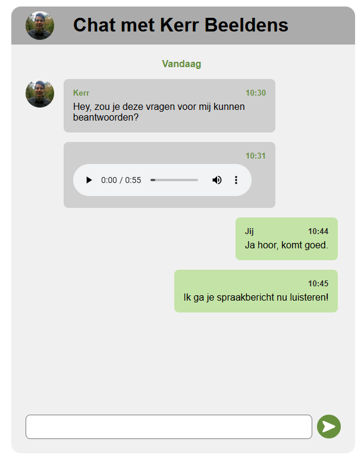

# Proces Week 1

# Check-out maandag 30/03 (iteratie 1)
TODO

# Check-out dinsdag 30/03 (test 1)
TODO

# Voortgang week 1
TODO

# Test rapportage week 1
Het doel van het eerste gesprek was nog niet zozeer om een concreet concept of idee aan hem voor te leggen, maar meer om een beeld te krijgen van het probleem. Daarnaast was het uiteraard ook van belang om inzichten op te doen met betrekking tot het computer gebruik van Ihab en mogelijke uitdagingen die hierbij komen kijken.

## Interview vragen
*Dit is een samenvatting met de meest relevante vragen en antwoorden die kwamen uit het eerste gesprek en test met Ihab. 
Zie (Notulen Test 1)[blabla] voor de volledige ruwe notulen.

### Gebruik van hulpmiddelen
>Welke Screenreader gebruikt Ihab? Met welke instellingen?

Ihab gebruikt met name NVDA en Jaws. Qua instellingen heeft hij vooral de snelheid waarmee de screenreader voorleest omhoog gezet. Tijdens dit gesprek heeft hij deze lager gezet zodat dit makkelijker te volgen is. Daarnaast gebruikt hij exclusief sneltoetsen en toetsenbord navigatie. Af en toe gebruikt hij nog weleens de linker- of rechtermuisknop. 

>Wanneer gebruikt Ihab telefoon of computer het liefst?

Volgens Ihab is het afhankelijk van de situatie. Op zijn laptop kan hij sneller navigeren waardoor hij makkelijker en sneller dingen kan regelen, maar onderweg is het vaak praktischer om zijn telefoon te gebruiken.
### Moeilijkheden
>Zijn er knoppen of functies in apps die Ihab lastig vindt te gebruiken?

Ihab is volledig afhankelijk van screenreaders om content van apps en websites te begrijpen. Hij heeft een voorbeeld laten zien van een app die niet goed werkt, namelijk de app *Insta360* die hij gebruikt voor een camera. Deze app is volledig visueel ingesteld en is niet mogelijk te navigeren met shortcuts of voor te lezen met een screenreader. Hij kan deze app op geen enkele manier gebruiken.

>Wat doe hij in het geval dat een app niet te gebruiken is? Heeft hij hier trucjes voor?

Over het algemeen probeert hij apps die niet fijn te gebruiken te zijn te vermijden. Hier lijkt hij ook vrij hard in te zijn. Werkt het niet, dan gebruikt hij een alternatief. Indien er geen alternatief is, bijvoorbeeld voor bankieren of als het de website is voor een bepaalde vereniging, dan probeert hij de layout van de website (of delen hiervan) uit zijn hoofd te leren. Dit wordt uiteraard moeilijker hoe ingewikkelder de website wordt.

### Spraakberichten
>Stuur en ontvangt Ihab weleens spraakberichten? Vind hij dit prettiger of minder prettig dan typen? 

Spraakberichten ontvangt hij vaak en verstuurt hij ook weleens. De reden dat hij dit doet is vergelijkbaar met "normale" mensen. Soms is het sneller dan typen.

> Zijn er specifieke situaties waarin spraakberichten handig zijn, of juist niet?

Vooral als hij geen zin heeft om een heel verhaal te typen zijn spraakberichten handig.  Hij heeft in het verleden ook weleens geprobeerd om berichten te dicteren, maar dit werkt vaak niet zo goed. 

Daarnaast vind hij het ook soms fijner om een spraakbericht te ontvangen. Hij vindt het fijn om soms om de emotie te horen in iemands stem (in plaats van een berichtje waarin emotie minder goed te peilen is). 

Soms zijn spraakberichten juist niet handig, vooral als de spraakberichten lang zijn (meer dan 5 minuten). Het is dan lastig om uit een lang verhaal de essentie te halen.

>Wat zou Ihab vinden van een functie om bookmarks toe te voegen aan een langer spraakbericht, zodat je eenvoudig informatie terug kan vinden?

Hij gaf aan dit op zich wel een leuk idee te vinden, maar hier niet direct behoefte aan had. Hij zag er wel potentie in voor echt lange spraakberichten (meer dan 10 - 15 minuten), maar voor kortere berichten vond hij het een minder goed idee.

> Wat zou Ihab vinden van AI integratie die een samenvatting maakt van een spraakbericht met de belangrijkste punten?

Dit leek hem nuttig, maar wel strict voor praktische spraakberichten of voor werk/studie. Hij had moeite met mogelijke privacy van berichten en stemmen van anderen in een AI tool verwerken en hij vond het ook dat voor persoonlijke berichten dit respectloos kon zijn (als een vriend ergens mee zit bijvoorbeeld).

## Test Protocol 1
De eerste test met Ihab verliep soepel. Ik wist nog niet zo goed wat ik moest verwachten, dus ik had een simpel prototype in elkaar gezet om te kijken hoe Ihab om zou gaan met het beluisteren van een spraakbericht en hierop reageren. Het testprotocol is hieronder weergegeven.

### Onderzoeksvraag
Hoe gaat Ihab om met spraakberichten in een Chat App waar geen/weinig rekening is gehouden met toegankelijkheid?

### Het prototype
Link naar GitHub commit van deze versie van het prototype:
https://github.com/KerrBeeldens/AanDePraat/commit/01377bc

Screenshot van het prototype:

Dit prototype is een fictieve chat applicatie die ik heb gemaakt zonder al teveel te denken aan toegankelijkheid. Ik heb de website gebouwd volgens common sense principes op het web en ik heb de website een paar keer met een screenreader geprobeerd te gebruiken. Dit met als doel om de chat applicatie niet ontoegankelijk te maken. Ik heb echter niet actief gewerkt aan het verbeteren van de standaard browser functionaliteit.

In het prototype zijn enkele chats te zien, met hierin een audio fragment. Dit fragment is hieronder te beluisteren:
[Spraakbericht Eerste prototype](media/week-1-spraakbericht.mp3)

Het transcript van dit fragment is als volgt:

> Hey, eh, hoi… ik wilde even wat vragen stellen over hoe je apps en je telefoon gebruikt, ja. Dus bijvoorbeeld… eh, gebruik je je telefoon of computer vooral op bepaalde momenten van de dag, of… ja, is dat eigenlijk heel verschillend?
> 
> En dan… eh, ik ben ook benieuwd naar spraakberichten. Stuur en ontvang je die vaak, of typ je liever? Zijn er situaties waarin het handiger is om iets te zeggen in plaats van te typen?
> 
> Ehm, en nog iets… denk aan apps die je gebruikt met een screenreader of andere hulpmiddelen… zijn er dingen die echt goed werken, en dingen die juist irritant zijn? Oh, en als je even bedenkt… stel dat je zelf spraakberichten zou mogen ontwerpen, wat zou er dan echt in moeten zitten?
> 
> Sorry, beetje veel vragen achter elkaar misschien, maar eh… ja, dat is zo’n beetje waar ik benieuwd naar ben."

Het is een bewust vaag spraakbericht om inzicht te krijgen in hoe Ihab hiermee om gaat. 
### Introductie voor Ihab
Voor mijn opdracht wil ik een applicatie waarmee het eenvoudiger wordt om ontvangen spraakberichten te ontvangen en beluisteren. U krijgt zo een eerste versie van deze app te zien en ik zou graag willen dat u voor mij een aantal taken voltooid. U mag de site openen zodra u klaar bent en dan ontvangt u van mij de eerste taak.

### Taken & Notities
> Zou u mij kunnen vertellen wat voor website u voor zich heeft en hoe deze werkt?

Ihab kon vrij eenvoudig door de site navigeren en kon met de screenreader uit de titel van de site halen dat het ging om een chat applicatie.

> Een chat applicatie bestaat uit berichten, zou u mij kunnen vertellen welke berichten er in de chat staat

Ihab kon wederom eenvoudig door de berichten navigeren. Hij kon uitleggen dat ik hem verzocht een paar vragen te beantwoorden en dat hij zei dat hij dit zal doen. Hij kon ook achterhalen dat de vragen in een spraakbericht stonden. Hij speelde dit spraakbericht één keer af.

> Zou u voor mij het spraakbericht in de chat applicatie kunnen beantwoorden?

Hij speelde opnieuw het spraakbericht af, maar kwam toen in de problemen. Hij probeerde namelijk te navigeren naar het input veld, maar het spraakbericht bleef maar afspelen. Hierdoor kon hij niet eenvoudig wisselen tussen deze twee. Hij probeerde wel te reageren, maar kwam niet verder dan een paar zinnen in steekwoorden. Daarnaast was het moeilijk voor hem om overzicht te houden over zijn acties doordat de audio bleef afspelen.

### Debriefing
Op basis van de taken die hij moest voltooien had Ihab de feedback om een shortcut in te bouwen die het mogelijk maakt om het spraakbericht op pauze te zetten en verder af te spelen. Ook zou hij graag willen zien dat hij de snelheid van het spraakbericht kan aanpassen, want hij vond dit nu wel erg traag.