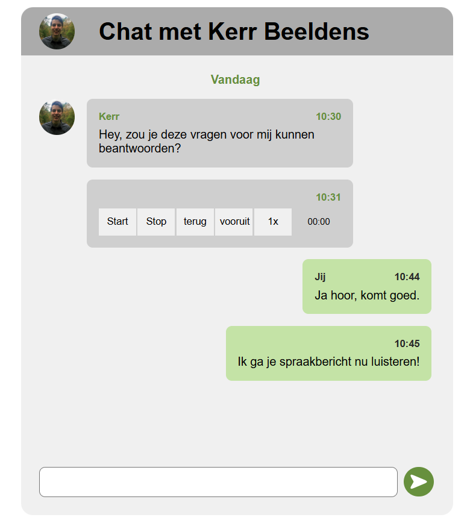

# Proces Week 2

> [!NOTE] Deze week was vanwege Pasen geen tijd maandag om aan een iteratie te werken. Ik heb vorige week dinsdag/donderdag met de tijd die ik ad daarom een relatief simpele iteratie gedaan. Ik reflecteer hierop in de check-out van dinsdag, die hieronder volgt.

# Check-out dinsdag 07/04 (iteratie + test 2)

Vandaag heb ik gewerkt aan een tweede iteratie van mijn chatapplicatie. Ik heb de standaard audio controls vervangen door toegankelijkere custom controls en keyboard shortcuts toegevoegd, zoals pauzeren met Ctrl + Spatie. Daarna heb ik een gebruikerstest uitgevoerd met Ihab om te onderzoeken hoe hij deze nieuwe bediening gebruikt tijdens het luisteren en reageren op een spraakbericht.

Tijdens de test probeerde Ihab eerst zelf de shortcuts te ontdekken, maar dit lukte niet omdat de screenreader deze niet voorlas. Nadat ik de shortcuts had uitgelegd, kon hij het spraakbericht soepel pauzeren, typen en weer hervatten zonder focusverlies. Dit werkte veel beter dan tijdens de vorige test. Samen kosten me dit ongeveer een uur of 8 (ik had in het weekend ook nog een beetje doorgewerkt)

Ik heb geleerd dat keyboard shortcuts alleen nuttig zijn als gebruikers ook kunnen ontdekken dat ze bestaan. De shortcuts werden niet automatisch voorgelezen door de screenreader, waardoor Ihab ze moeilijk kon vinden. Ook zag ik dat het kunnen bedienen van audio zonder focusverlies een grote verbetering was voor de gebruikservaring. Daarnaast gaf Ihab waardevolle feedback over extra shortcuts, zoals doorspoelen en snelheid aanpassen.

Voor de volgende test ga de feedback uit deze test verwerken door extra shortcuts toe te voegen voor doorspoelen en snelheid aanpassen. Daarnaast wil ik ervoor zorgen dat shortcuts worden voorgelezen wanneer een knop focus krijgt en enkele knopnamen duidelijker maken. Daarnaast wil ik de volgende keer ook een wat grotere, interessantere functionaliteit toevoegen.

# Voortgang week 2

In week 2 heb ik verder gewerkt aan de toegankelijkheid van mijn chatapplicatie voor screenreadergebruikers. Omdat er door Pasen minder tijd beschikbaar was, heb ik deze week een relatief kleine maar gerichte iteratie uitgevoerd. De focus lag volledig op het verbeteren van de gebruikerservaring rondom spraakberichten.

Vorige week bleek uit de gebruikerstest dat de standaard audio controls van de browser niet prettig werkten voor Ihab. Vooral het combineren van luisteren naar een spraakbericht en tegelijkertijd typen van een reactie was lastig. Daarom heb ik deze week onderzocht hoe ik de bediening toegankelijker kon maken met behulp van custom controls en keyboard shortcuts.

Ik heb hiervoor de native audio controls vervangen door eigen knoppen met toegankelijkheidsattributen en keyboard ondersteuning. Hierbij heb ik gebruik gemaakt van een MDN-artikel over toegankelijke mediacomponenten. Ook heb ik een shortcut toegevoegd (Ctrl + Spatie) waarmee het spraakbericht gepauzeerd en hervat kan worden zonder de focus uit het tekstveld te halen.

De werking van de shortcuts zijn weergegeven in de onderstaande video. Merk op dat de toetsen die visueel in beeld een extra programma zijn en geen onderdeel van de demo zijn. Ik toon dit om het duidelijker te maken welke toetsten ik indruk voor de shortcuts.

Tijdens de tweede gebruikerstest bleek dat deze verandering een duidelijke verbetering was. Ihab kon het spraakbericht nu onderbreken, een reactie typen en daarna direct verder luisteren. Hierdoor verliep de interactie veel vloeiender dan tijdens de eerste test.

De test bracht ook nieuwe verbeterpunten naar voren. Zo waren de shortcuts moeilijk te ontdekken omdat screenreaders deze niet automatisch voorlazen. Daarnaast ontstond behoefte aan extra shortcuts voor snelheid aanpassen en vooruit- of terugspoelen. Ook bleek dat de terminologie van sommige knoppen niet duidelijk genoeg was.

De feedback uit deze week vormt de basis voor de volgende iteratie, waarin ik de keyboard interacties verder ga uitbreiden en experimenten wil doen met aanvullende UX-functionaliteit voor spraakberichten.

# Test rapportage week 2

Het doel van het tweede gesprek was om mijn iteratie van deze week te testen. Vorige week was het prototype nog lastig te gebruiken voor Ihab. Ik heb deze week geprobeerd om de gebruikerservaring op deze vlakken te testen.

\*Dit is een bewerkte versie van mijn notulen tijdens de test. Zie [Ruwe Notulen User Tests](./Ruwe%20Notulen%20User%20Tests.md) voor de volledige ruwe notulen.

Het testprotocol is hieronder weergegeven.

## Test Protocol 1

### Onderzoeksvraag

Hoe gebruikt Ihab shorcuts in een Chat App en hoe komt hij erachter hoe hij deze moeten gebruiken?

### Het prototype

Link naar GitHub commit van deze versie van het prototype:

https://github.com/KerrBeeldens/AanDePraat/commit/53f6c72

Screenshot van het prototype:

Zoals in de figuur te zien is, er relatief weinig verandert ten opzichte van de vorige keer. De belangrijkste veranderingen aan de user experience zijn de knoppen van het spraakbericht. Voorheen had ik gewoon het standaar audio element gebruikt met native controls, maar met behulp van een MDN artikel over het accessible maken van media componenten heb ik deze controls verbeterd. Daarnaast heb ik ook ervoor gezorgd dat de Ihab het spraakbericht kan pauzeren (met ctrl + spatie).

In het prototype zijn enkele chats te zien, met hierin een audio fragment. Dit fragment is hieronder te beluisteren. De chat en spraakbericht zijn hetzelfde ten opzichte van vorige week.

[Spraakbericht Eerste prototype](media/week-1-spraakbericht.mp3)

Het transcript van dit fragment is als volgt:

> Hey, eh, hoi… ik wilde even wat vragen stellen over hoe je apps en je telefoon gebruikt, ja. Dus bijvoorbeeld… eh, gebruik je je telefoon of computer vooral op bepaalde momenten van de dag, of… ja, is dat eigenlijk heel verschillend?
>
> En dan… eh, ik ben ook benieuwd naar spraakberichten. Stuur en ontvang je die vaak, of typ je liever? Zijn er situaties waarin het handiger is om iets te zeggen in plaats van te typen?
>
> Ehm, en nog iets… denk aan apps die je gebruikt met een screenreader of andere hulpmiddelen… zijn er dingen die echt goed werken, en dingen die juist irritant zijn? Oh, en als je even bedenkt… stel dat je zelf spraakberichten zou mogen ontwerpen, wat zou er dan echt in moeten zitten?
>
> Sorry, beetje veel vragen achter elkaar misschien, maar eh… ja, dat is zo’n beetje waar ik benieuwd naar ben."

Het is een bewust vaag spraakbericht om inzicht te krijgen in hoe Ihab hiermee om gaat.

Het doel van deze test is om voldoende feedback te verzamelen om een definitieve versie te maken van de "standaard" spraakbericht controls, inclusief shortcuts. De volgende keer wil ik dan "nonsense" toevoegen en extra functionaliteit om de UX echt te gaan enhancen.

### Introductie voor Ihab

De vorige keer dat u mijn chat applicatie heeft getest had u moeite met het bedienen van het spraakbericht, in het bijzonder terwijl u aan het reageren was op het spraakbericht. Ik heb in deze versie de gebruikerservaring hopelijk verbetert. U mag de site openen zodra u klaar bent en dan ontvangt u van mij de eerste taak.

### Taken & Notities

> De website is dezelfde website als de vorige keer, alleen dit keer zijn er ook shortcuts om het spraakbericht te bedienen. Kunt u de shortcuts voor mij vinden.

Ihab lukte het niet om de shortcuts te vinden. Er was geen duidelijke manier waarop de shortcuts werden voorgelezen aan hem, waardoor hij ze niet kon gebruiken. Ihab gaf aan dat hij het fijn zou vinden dat als een knop een shortcut had, dat de shortcut werd voorgelezen zodra hij op de knop staat.

Ik heb hem hierna de shortcuts verteld.

> Zou u voor mij het spraakbericht in de chat applicatie kunnen beantwoorden?

Hij speelde het spraakbericht af, zette het spraakbericht op pauze met de shortcut en begon met typen. Zodra hij een stukje geschreven had, ging hij verder met het spraakbericht, wederom met de shortcut. Hij kon op deze manier vrij vloeiend op het spraakbericht reageren.

> Wat vond u van deze gebruikerservaring?

Hij vond dit erg prettig werken. Hij had nog wel de volgende suggesties voor shortcuts:

- Snelheid van spraakbericht aanpassen: control + pijl omlaag/omhoog
- Terug/vooruit spoelen: control + pijl links/rechts

Verder vond hij dat de terug vooruit knop moest zeggen hoeveel terug en vooruit er werd gespoeld (in dit geval 3 seconden) en vond hij de naam van de stop knop niet logisch. Hij stelde de naam "opnieuw afspelen" voor.

### Debriefing

Op basis van de test zal ik de volgende verbeteringen de volgende keer toepassen:

- shortcuts moeten voorgelezen worden zodra een knop geselecteerd is.
- De Snelheid van spraakbericht moet kunnen worden aangepast worden met control + pijl omlaag/omhoog
- Het spraakbericht moet kunnen worden doorgespoeld worden met control + pijl naar rechts en terug met control + pijl naar links. Bij deze knop moet ook worden aangegeven worden hoeveel er wordt teruggespoeld (3 seconden).
- De stop knop zal worden verandert naar "opnieuw afspelen".
