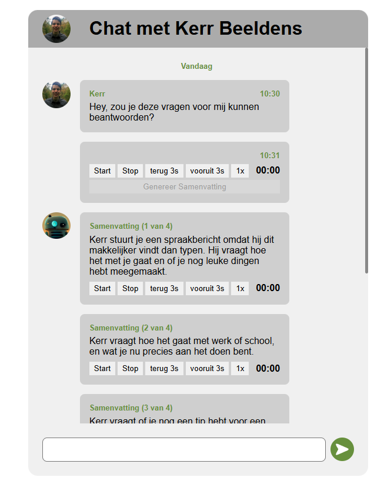

# Proces Week 3

_Vanwege Smashing conference was er geen voortgangsgesprek en heb ik deze week ook weinig voortgang gemaakt. Ik heb hierdoor geen user test kunnen uitvoeren. De week daarop was ik ziek bij de test en heb ik dus ook die week geen test uit kunnen voeren. Op 7 mei heb ik met Ihab een extra test uitgevoerd. De week van 4 mei t/m 7 mei label ik daarom als week 3. Het assessment van 8 mei en de herkansingsweek van 11 t/m 13 april vormen hiermee week 4_

# "Check-out" woensdag 06/05 (iteratie 3)

Uit de vorige test was gebleken dat Ihab door middel van de shortcuts een stuk beter kon reageren op het spraakbericht. Echter lukte het hem nog niet om de shortcuts zelf te vinden, omdat dit nergens was aangegeven. Ik heb daarom deze week met `aria-keyshortcuts` keyboard shortcut tips toegevoegd aan de applicatie. Als toevoeging voor deze week heb ik gewerkt aan het maken van een samenvatting functie, zogenaamd door middel van AI. Uiteraard gaat het om een prototype dus dit heb ik niet daadwerkelijk geimplementeerd, maar het idee is dat AI het spraakbericht analyseerd, opdeelt in logische stukken en vervolgens een samenvatting geeft per deel. Het implementeren hiervan duurde zo'n 6 uur.

Ik heb geleerd te werken met `aria-keyshortcuts` om het mogelijk te maken een shortcut tip toe te voegen aan een button. Ik heb ook geleerd dat er shortcuts zijn om tussen heading te springen, dus heb ik elk van mijn message blocks een heading gegeven op de plaats waar op dit moment een span stond met de ontvanger. Dit zorgt er hopelijk voor dat het makkelijker wordt de site te navigeren.

# Check-out donderdag 07/05 (test 3)

TODO

# Voortgang week 3

TODO

# Test rapportage week 3

\*Dit is een bewerkte versie van mijn notulen tijdens de test. Zie [Ruwe Notulen User Tests](./Ruwe%20Notulen%20User%20Tests.md) voor de volledige ruwe notulen.

Het testprotocol is hieronder weergegeven.

## Test Protocol 3

Het doel van deze test was om het AI samenvat systeem te testen.

### Onderzoeksvraag

Zorgt een AI samenvatting ervoor dat het voor Ihab makkelijker is om op een spraakbericht te reageren?

### Het prototype

Link naar GitHub commit van deze versie van het prototype:

https://github.com/KerrBeeldens/AanDePraat/commit/2a692a0

Screenshot van het prototype:

Het doel van deze test was om het AI samenvat systeem te testen.

In het prototype zijn enkele chats te zien, met hierin een audio fragment. Er is nu een "Genereer Samenvatting" knop aanwezig in het prototype. Zodra de gebruiker hierop drukt wordt er zogenaamd een AI samenvatting gemaakt van het spraakbericht. Het bericht wordt opgedeeld in delen, waarna elk deel afzonderlijk te luisteren valt. Bij elk deel staat ook een tekstuele samenvatting van de inhoud van dat deel. Ik heb voor deze test een langer, rommeliger audio fragment gemaakt ten opzichte van de vorige twee tests. Dit fragment is hieronder te beluisteren.

[Spraakbericht Eerste prototype](media/week-3-spraakbericht.mp3)

Het transcript van dit fragment is als volgt:

> Heeey, euhm… ja, hoi! Ik dacht dus, ik stuur gewoon even een spraakberichtje, want ja… typen had ook gekund maar dit is… weet je… iets makkelijker ofzo.
>
> Maar euhm, hoe gaat het eigenlijk met je? Echt, gewoon… in het algemeen? Want ik dacht daar dus ineens aan en toen dacht ik ja, ik moet gewoon even vragen, haha.
>
> Euh… wat heb je eigenlijk de laatste tijd gedaan? Nog iets leuks meegemaakt ofzo, of juist niet? Want ik heb dus… ja, een beetje van alles en eigenlijk ook weer niks bijzonders, snap je? Gewoon van die dagen die een beetje in elkaar overlopen.
>
> Oh ja en, euhm… hoe gaat het met werk of studie of wat je ook doet? Want ik hoor echt van iedereen dat het een beetje druk is en zo, en ik heb dat dus ook, maar dan soms ook weer niet, en dan denk ik… wat ben ik nou precies aan het doen? Echt zo’n momentje van, euhm… ja.
>
> En trouwens, heb je misschien nog tips voor een serie of film? Want ik zit dus steeds te scrollen en dan denk ik “nee… nee… ook niet…” en dan eindig ik dus weer met iets wat ik al heb gezien. Echt super irritant eigenlijk.
>
> Euhm… oh wacht, ik wilde nog iets vragen… ja, wanneer heb je weer een keer tijd om af te spreken? Want het is echt al… hoe lang is het? Best wel lang eigenlijk. En elke keer denk ik “we moeten echt iets plannen” en dan gebeurt het gewoon niet, typisch.
>
> En hoe gaat het verder met, euhm… ja, gewoon thuis en zo? Alles een beetje chill? Of ook een beetje chaos soms, want dat heb ik dus echt af en toe.
>
> Oh en, euhm… ja, ik had nog iets maar ik ben het dus helemaal kwijt, typisch dit weer. Komt vast later weer in me op, haha.
>
> Maar goed, euhm… ik ga je niet langer lastigvallen met mijn gebrabbel hier. Laat gewoon even iets van je horen wanneer je kan, geen haast ofzo.
>
> Oké, bye!

Het is een bewust vaag spraakbericht om inzicht te krijgen in hoe Ihab hiermee om gaat.

### Introductie voor Ihab

De vorige test had ik je gevraagd om met behulp van wat shortcuts een spraakbericht te beantwoorden. Op basis van de feedback van die test heb ik mijn prototype verbeterd. Daarnaast heb ik ook wat nieuwe functionaliteit toegevoegd, namelijk de mogelijkheid om een spraakbericht te laten samenvatten door AI. In deze test gaan we de verbeterde functionaliteit en de nieuwe functies testen.

### Taken & Notities

> De vorige keer kon u de shortcuts voor de spraakbericht controls niet vinden. Zou u deze in dit prototype opnieuw kunnen proberen te vinden?

TODO

> De chat applicatie maakt het mogelijk om een AI samenvatting te genereren. Zou u dit kunnen proberen?

TODO

> Zou u voor mij het spraakbericht in de chat applicatie kunnen beantwoorden door gebruik te maken van de AI samenvatting?

TODO

> Wat vind u van deze manier van reageren op een spraakbericht?

TODO

### Debriefing

TODO
